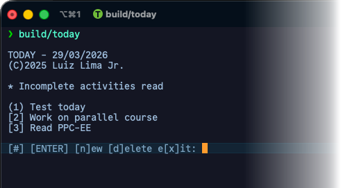

# TODAY

This app tracks your daily tasks and helps you manage your time efficiently.

Type in all the tasks you have for today. Choose a task and type CTRL-C to pause it, mark it as finished, or switch to another task.



* `#` –  Type the number of the activity to start it.
* `ENTER` starts the first activity. 
* Type `n` to enter new activities. 
* Type `d` and the number of the activity (e.g., `d2`) to delete it. 
* Type `x` to exit the application. 

## Features

- Add, edit, and delete tasks
- Mark tasks as completed

## Technical details

#### Library dependencies

* [nlohmann/json](https://github.com/nlohmann/json) – JSON library
* [libfmt](https://github.com/fmtlib/fmt) – for text coloring

C++ 23 required.

#### Compile with (using CMake/Ninja):

```bash
cd today
cmake --preset=ninja --fresh
cmake --build build --clean-first
```

`make` also available.

#### Run the application with:

```bash
build/today
```

The activity list will be saved in the file `activities.json` located at `~/Library/Application Support/today` (on macOS).

### Future work

- Set deadlines and reminders
- Organize tasks by categories
- View tasks in a calendar format
- Sync tasks across devices
- User-friendly interface
- Dark mode support
- Offline access
- Export tasks to CSV or PDF

## Author

Copyright (C) 2025 by Luiz A. de P. Lima Jr.
